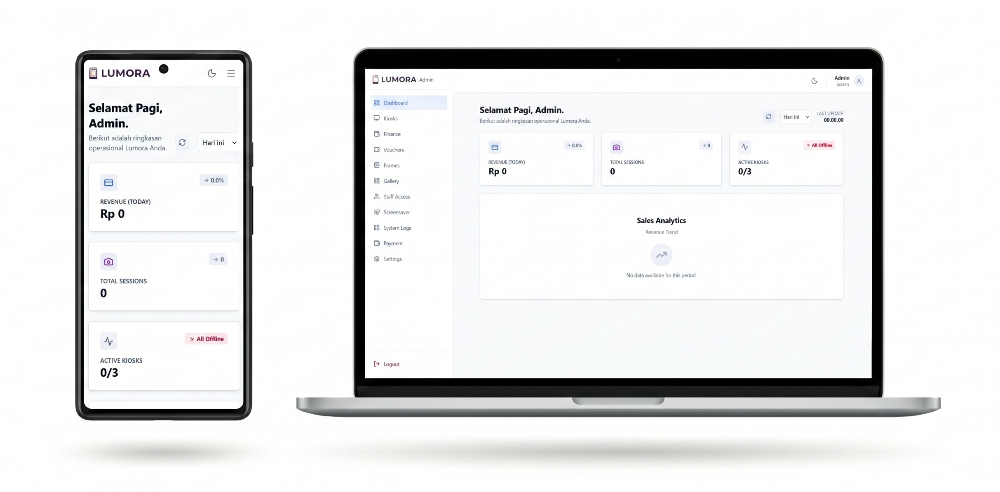

# 📸 Photobooth SaaS & Desktop Kiosk

> **⚠️ Disclaimer**  
> Full source code for this project is stored in a private repository due to an NDA with the client.  
> This repository serves as an **architectural showcase** and case study of the system I developed as a Freelance Full-Stack Developer.  
> I’m happy to discuss the technical details, architecture, state management, and hardware integration during an interview.

## 🖥️ SaaS Admin Dashboard Preview



*A modern and fully responsive SaaS dashboard built with TypeScript and Tailwind CSS, designed for Admin and Superadmin to monitor revenue, active sessions, kiosk status, and analytics in real-time.*

## 📖 Project Overview

This project is a **hybrid SaaS + Desktop Kiosk** application for managing and operating photobooth machines. It combines a powerful cloud-based admin dashboard with a lightweight, high-performance desktop application running on Windows-based kiosks.

The system bridges modern web technologies with local hardware integration, enabling real-time image processing, secure cloud synchronization, and remote monitoring.

## 🛠️ Tech Stack

- **Frontend (SaaS & Kiosk UI):** React, Next.js, TypeScript, Tailwind CSS
- **Desktop Wrapper:** Tauri (Rust) – lightweight and secure alternative to Electron
- **Backend & Database:** Supabase (PostgreSQL) + REST APIs
- **Target Environment:** Windows-based Kiosk Machines

## ✨ Key Features

### 1. Type-Safe SaaS Admin Dashboard
Built with **TypeScript** and **Tailwind CSS** to ensure high code quality, excellent maintainability, and a clean, responsive user interface across all devices.

### 2. Hybrid Desktop Kiosk Application
Wrapped using **Tauri**, allowing the React frontend to securely access local hardware (camera, printer, file system) while maintaining high performance and a minimal memory footprint.

### 3. Streamlined Role-Based Access
Simplified to only **Admin** and **Superadmin** roles. The kiosk version removes unnecessary layers to provide operators with a focused and secure working environment.

### 4. Secure Machine Activation System
Implemented a custom activation flow for new physical kiosks using a strict `XXX-XXX` alphanumeric code format.

```typescript
/**
 * Validates machine activation code against XXX-XXX format.
 * @param code - Activation code input
 * @returns boolean
 */
const validateActivationCode = (code: string): boolean => {
  const regexPattern = /^[A-Z0-9]{3}-[A-Z0-9]{3}$/;
  
  if (!code) return false;
  return regexPattern.test(code.trim().toUpperCase());
};
📈 Impact & Results
The architecture successfully delivered a scalable, reliable, and maintainable photobooth management system. The Tauri-based desktop app ensures fast local photo processing, while the Supabase backend allows administrators to securely monitor machine health and business metrics from anywhere.

Created by Nauval Azfa Mahendra • 2026
